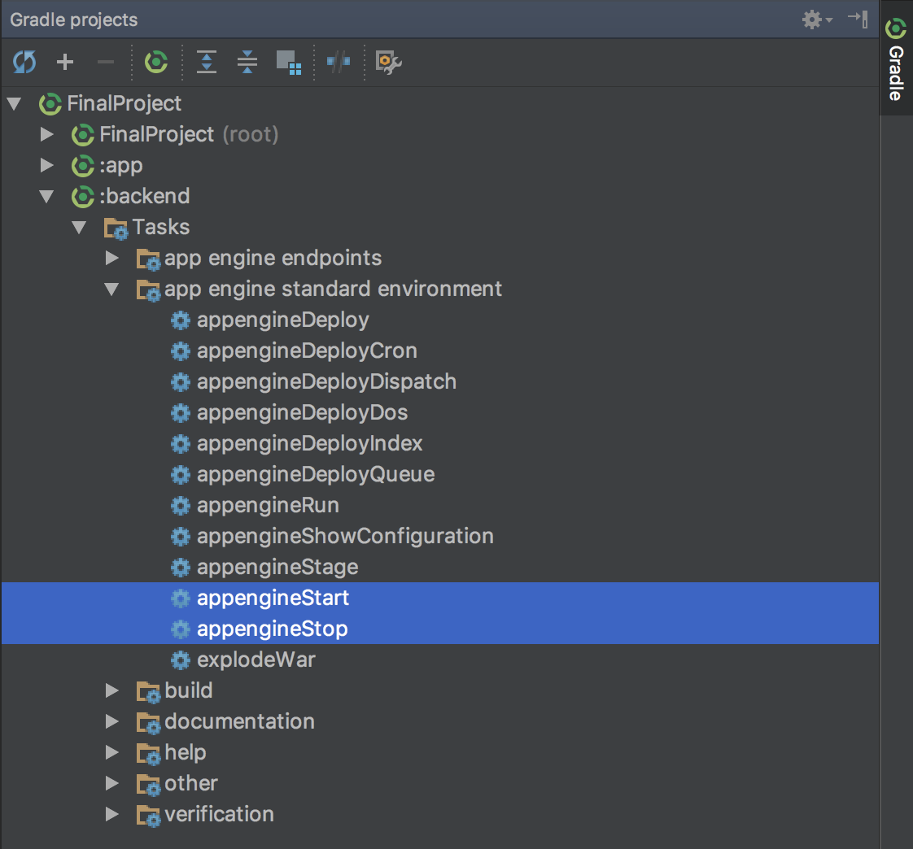

# Build it Bigger App

This android project is created as part of Udacity Nanodegree program offerred by Google.

## App OVerview

As Android projects grow in complexity, it becomes necessary to customize the
behavior of the Gradle build tool, allowing automation of repetitive tasks.
Particularly, factoring functionality into libraries and creating product
flavors allow for much bigger projects with minimal added complexity. The purpose of this app is to apply the learnings on how to handle these situations. The app has multiple flavors that uses multiple libraries and Google Cloud Endpoints. The app has four modules. A Java library that provides jokes, a Google Cloud Endpoints (GCE) project that serves those jokes, an Android Library containing an activity for displaying jokes, and an Android app that fetches jokes from the GCE module and passes them to the Android Library for display.

## App uses the following

1. [Google Client Endpoints (GCE)](https://cloud.google.com/endpoints/)
2. [Android Testing Tool Espresso](https://developer.android.com/training/testing/espresso/)

## Screenshots

## How to Setup GCE

This next task will be pretty tricky. Instead of pulling jokes directly from
our Java library, we'll set up a Google Cloud Endpoints development server,
and pull our jokes from there. The starter code already includes the GCE module 
in the folder called backend.

Before going ahead you will need to be able to run a local instance of the GCE 
server. In order to do that you will have to install the Cloud SDK:

https://cloud.google.com/sdk/docs/

Once installed, you will need to follow the instructions in the Setup Cloud SDK
section at:

https://cloud.google.com/endpoints/docs/frameworks/java/migrating-android

Note: You do not need to follow the rest of steps in the migration guide, only
the Setup Cloud SDK.

Start or stop your local server by using the gradle tasks as shown in the following
screenshot:

Once your local GCE server is started you should see the following at 
[localhost:8080](http://localhost:8080)

Now you are ready to continue! 

Introduce a project dependency between your Java library 
and your GCE module, and modify the GCE starter code to pull jokes from your Java library. 
Create an AsyncTask to retrieve jokes using the template included int these 
[instructions](https://github.com/GoogleCloudPlatform/gradle-appengine-templates/tree/77e9910911d5412e5efede5fa681ec105a0f02ad/HelloEndpoints#2-connecting-your-android-app-to-the-backend). 
Make the button kick off a task to retrieve a joke, 
then launch the activity from your Android Library to display it.

## Disclaimer
The initial code for the project was provided by Udacity and the same can be found [here](https://github.com/udacity/ud867/tree/master/FinalProject).
